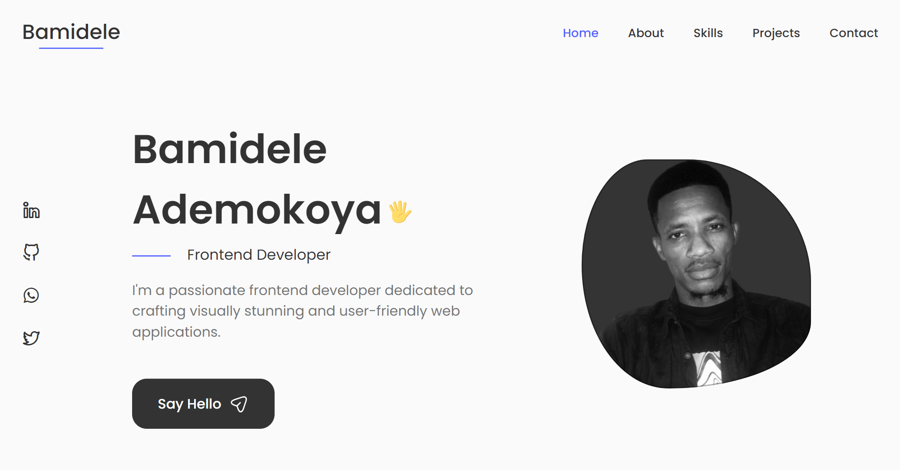

# My Portfolio

## Overview

Welcome to my personal portfolio! This project showcases my skills, projects, and experiences as a web developer. Built with React and styled using custom CSS, it provides a visually appealing and interactive way to learn more about me.

## Features

- **Responsive Design:** Ensures a seamless experience across various devices.
- **Project Showcase:** Highlighting key projects I've worked on.
- **Contact Form:** Easily get in touch with me using the integrated contact form.
- **Interactive Swiper:** Smoothly navigate through different sections.

## Technologies Used

- React
- Custom CSS
- Swiper (for interactive sliding sections)
- EmailJS (for the contact form)

## Installation

1. Clone the repository: `git clone https://github.com/dezmanvee/my-portfolio.git`
2. Navigate to the project directory: `cd my-portfolio`
3. Install dependencies: `npm install`
4. Run the project: `npm start`

## Usage

Visit the live demo [here](https://dezmanvee.netlify.app/). Explore different sections, check out my projects, and feel free to reach out using the contact form.

## Thumbnail

## Contact

Have questions or feedback? Reach out to me via email at [bamyonline@gmail.com](mailto:bamyonline@gmail.com).

